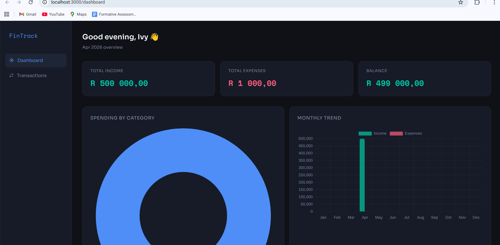
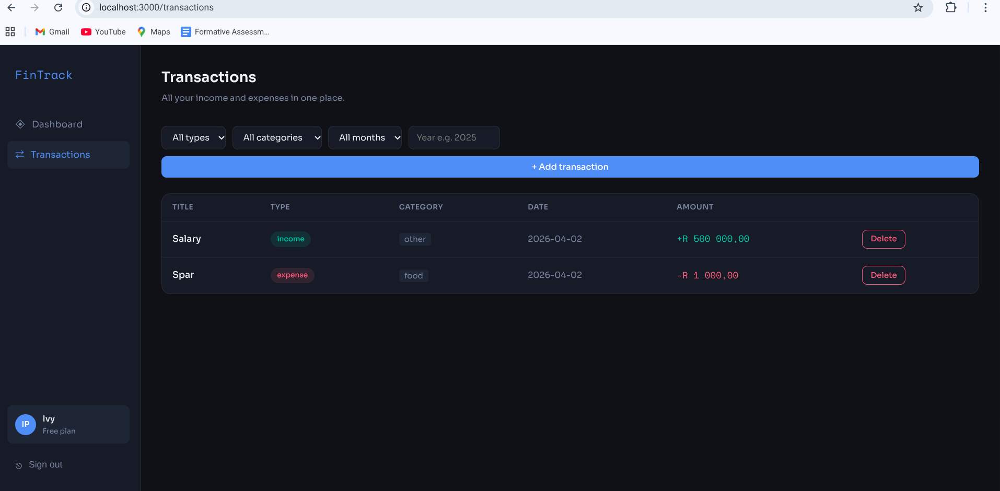

# 💰 FinTrack App

A full-stack **personal finance dashboard** that helps users take control of their money — track income and expenses, set budget categories, and visualize spending habits through interactive charts.

---

## 🚀 Features

- 🔐 **User Authentication** — Secure login and registration
- 💸 **Expense Tracking** — Log and categorize your spending
- 💵 **Income Tracking** — Record multiple income sources
- 📊 **Charts & Visualizations** — Understand your finances at a glance
- 🗂️ **Budget Categories** — Organize transactions by category
- 🧾 **Transaction History** — Full log of all financial activity

---

## 🛠️ Tech Stack

| Frontend | Backend | Database |
|----------|---------|----------|
| React | Django REST Framework | SQLite |
| CSS | Python | |

---

## 📸 Screenshots




---

## ⚙️ Getting Started
```bash
# Backend
cd backend
source venv/bin/activate
python3 manage.py runserver

# Frontend
cd frontend
npm start
```

---

## 👩🏾‍💻 Author

**Ivy Pule** — [github.com/ivypule1](https://github.com/ivypule1)
